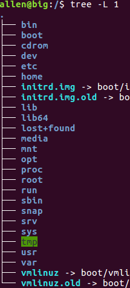
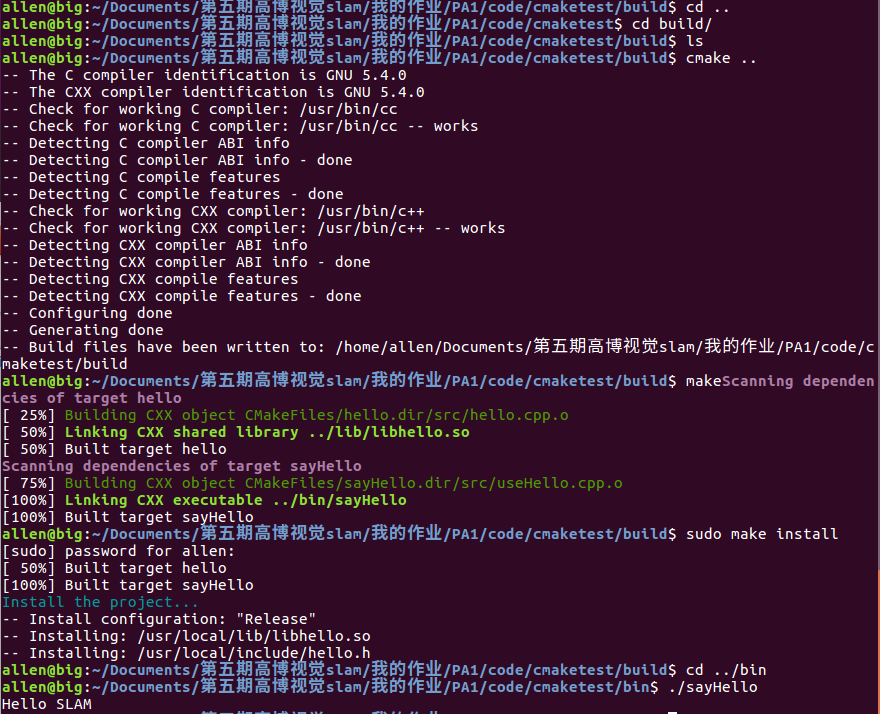
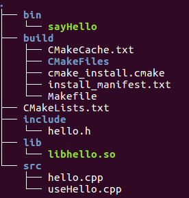
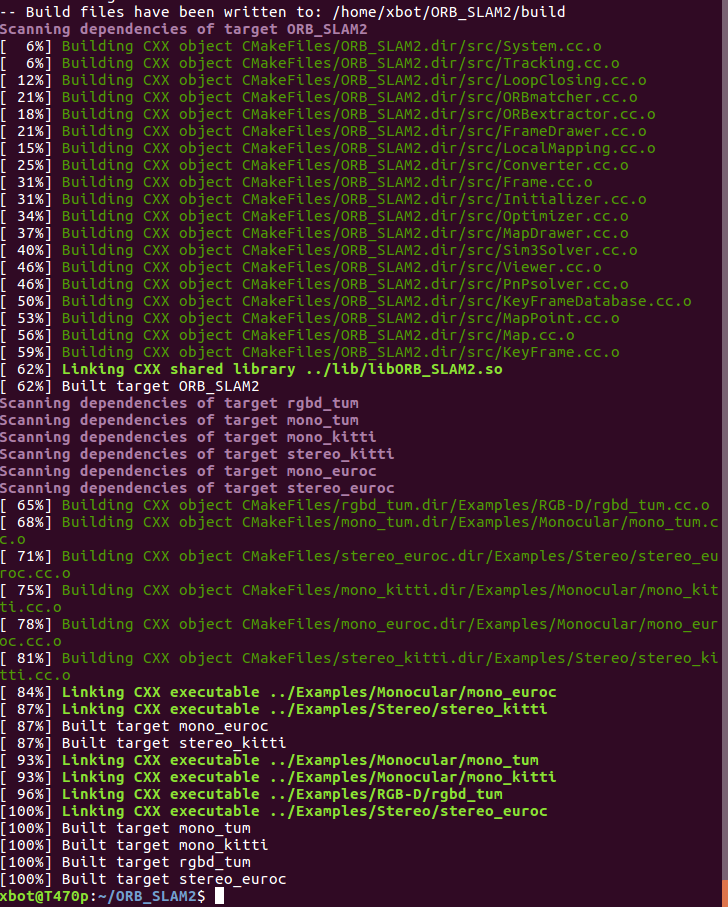

## 一、熟悉linux
计算机领域的绝大多数科研人员都在 Linux 下工作,不掌握 Linux 会使你在研究道路上寸步难行。
Linux 系统的基本知识亦是学习本课程的先决条件。如果你还未接触过 Linux,请阅读本次习题中提供的
材料(见 books/目录下)
。建议阅读《鸟哥的 Linux 私房菜》第 1、2 章了解 Linux 历史,第 5-8 章了解
基础操作。如果你在用 Ubuntu,也可以参考 Ubuntu 维基上自带的指南:http://wiki.ubuntu.org.cn/

#### 1. 如何在 Ubuntu 中安装软件(命令行界面)?它们通常被安装在什么地方？

`sudo apt-get intall XXX`
例如：
`sudo apt-get install gcc`

**安装位置**

软件分布在系统的各个文件夹中

可执行文件： /usr/bin

库文件： /usr/lib

配置文件： /etc

文档： /usr/share

#### 2. linux 的环境变量是什么?我如何定义新的环境变量?

系统与软件在运行过程中，通过环境变量寻找参数，例如：第三方库，某些软件位置等

ubuntu存储环境变量的文件如下：

- etc/environment: 设置整个系统的环境
- etc/profile: 用户登录时执行一次，用于设置所有用户使用的全局变量
- etc/bashrc: 每次打开shell执行一次
- ~/.profile: 用户登录执行一次，仅对当前用户有效
- ~/.bashrc: 每次打开shell执行一次，仅对当前用户有效

**定义新的环境变量**
确认需求,在上述对应的文件后添加：
`$ export PATH=my_path:$PATH`


#### 3. linux 根目录下面的目录结构是什么样的?至少说出 3 个目录的用途。

**根目录结构：**



**目录用途：**

- /bin: 二进制可执行文件的目录
- /media: 可移除装置，包括软盘、光盘、硬盘、U盘、各种盘
- /etc: 系统主要配置文件，常用的有/etc/init.d/:所有服务的自启动脚本
- /var: 存放系统运作过程生成的各种文件（log, run, cache等）
- /usr: 几乎所有的应用程序和文件目录，类似windows下的C:\Windows\ + C:\Program files\的综合体


#### 4. 假设我要给 a.sh 加上可执行权限,该输入什么命令?

`sudo chmod +x a.sh`


#### 5. 假设我要将 a.sh 文件的所有者改成 xiang:xiang,该输入什么命令?

`sudo chown xiang:xiang a.sh`

## 二、SLAM 综述文献阅读

#### 1.SLAM 会在哪些场合中用到?至少列举三个方向。
AR， 移动机器人，自动驾驶， 无人机

#### 2.SLAM定位与建图是什么关系?为什么在定位的同时需要建图?
定位和建图二者相辅相成，高精地图确保准确的定位，同时，定位的准确性极大影响建图的效果。

#### 3.SLAM 发展历史如何?我们可以将它划分成哪几个阶段?
大致有如下里程碑：
1. EKF-SLAM： 滤波器实用非常重要的一步
2. FASTSLAM:  加入粒子滤波重定位
3. Graph-SlAM：目前90%的学者都在做这一块吧
---
激光slam部分：

GMapping

LOAM： Ji Zhang

V-LOAM： 视觉做补偿

Cartographer： google开源

#### 4.列举三篇在 SLAM 领域的经典文献。

2008年：EKF monocular SLAM 将slam推向单目相机，低成本slam成为可能
> Civera J, Davison A J, Montiel J M M. Inverse depth parametrization for monocular SLAM[J]. IEEE transactions on robotics, 2008, 24(5): 932-945.

ORB-SLAM
> Mur-Artal R, Montiel J M M, Tardos J D. ORB-SLAM: a versatile and accurate monocular SLAM system[J]. IEEE transactions on robotics, 2015, 31(5): 1147-1163.

Vins-mono
> Qin T, Li P, Shen S. Vins-mono: A robust and versatile monocular visual-inertial state estimator[J]. IEEE Transactions on Robotics, 2018, 34(4): 1004-1020.
## 三、CMake 练习

cmake 是一种常用、方便的,用于组织 Linux 下 C++ 程序的工具。有许多库,例如 OpenCV、g2o、
Ceres 等,都用 cmake 组织它们的工程。所以,不管是使用别人的库,还是编写自己的库,都需要掌握
一些 cmake 的基本知识。

完成以下工作：
书写一个由 cmake 组织的 C++ 工程,要求如下:
1. include/hello.h 和 src/hello.c 构成了 libhello.so 库。hello.c 中提供一个函数 sayHello(),调用此函
数时往屏幕输出一行“Hello SLAM”。我们已经为你准备了 hello.h 和 hello.c 这两个文件,见“code/”
目录下。
2. 文件 useHello.c 中含有一个 main 函数,它可以编译成一个可执行文件,名为“sayhello”。
3. 默认用 Release 模式编译这个工程。
4. 如果用户使用 sudo make install,那么将 hello.h 放至/usr/local/include/下,将 libhello.so 放
至/usr/local/lib/下。
请按照上述要求组织源代码文件,并书写 CMakeLists.txt。


**问题**

提供给我们的代码是.c后缀，但是里面却写着
`#include <iostream>`
导致编译不通过

我把c文件都改成cpp后缀了

**回答：**

CMakeLists.txt文件内容

```CMakeLists
SET (PROJECT_NAME cmaketest)

PROJECT(${PROJECT_NAME})
CMAKE_MINIMUM_REQUIRED(VERSION 2.8)

# 设置编译模式
SET(CMAKE_BUILD_TYPE Release) # Release, RelWithDebInfo , Debug

# 设置可执行文件的输出路径和库文件路径
SET(EXECUTABLE_OUTPUT_PATH ${PROJECT_SOURCE_DIR}/bin)
SET(LIBRARY_OUTPUT_PATH ${PROJECT_SOURCE_DIR}/lib)

set(CMAKE_CXX_FLAGS "${CMAKE_CXX_FLAGS} -std=c++11")

# 头文件
INCLUDE_DIRECTORIES(${PROJECT_SOURCE_DIR}/include)

# 生成共享库
add_library(hello SHARED ${PROJECT_SOURCE_DIR}/src/hello.cpp)

# 生成可执行文件
add_executable(sayHello ${PROJECT_SOURCE_DIR}/src/useHello.cpp)

# 将库文件链接到可执行文件上
target_link_libraries(sayHello hello)


# make install 部分

install(TARGETS hello LIBRARY DESTINATION /usr/local/lib)
install(FILES ${PROJECT_SOURCE_DIR}/include/hello.h DESTINATION /usr/local/include)
```

**运行结果**


**最终项目的目录如下：**




## 四、理解ORB-SLAM2框架

#### 1. 从 github.com 下载 ORB-SLAM2 的代码


#### 2. 分析ORB-SLAM2代码结构

(a) ORB-SLAM2 将编译出什么结果?有几个库文件和可执行文件?

**回答：**

一个库文件：
ORB_SLAM2.so

6个可执行测试文件：

rgbd_tum、stereo_kitti、stereo_euroc、mono_tum、
mono_kitti、mono_euroc


(b) ORB-SLAM2 中的 include, src, Examples 三个文件夹中都含有什么内容?

- include文件夹：生成库的头文件
- src文件夹： 生成库的源码
- Example： 可执行文件与不同相机对应的相机标定文件

(c) ORB-SLAM2 中的可执行文件链接到了哪些库?它们的名字是什么?

**回答：**

链接的库文件包括：

自身编译生成的动态库如下：
```
src/System.cc
src/Tracking.cc
src/LocalMapping.cc
src/LoopClosing.cc
src/ORBextractor.cc
src/ORBmatcher.cc
src/FrameDrawer.cc
src/Converter.cc
src/MapPoint.cc
src/KeyFrame.cc
src/Map.cc
src/MapDrawer.cc
src/Optimizer.cc
src/PnPsolver.cc
src/Frame.cc
src/KeyFrameDatabase.cc
src/Sim3Solver.cc
src/Initializer.cc
src/Viewer.cc
```

外部链接的库包括：

```
${OpenCV_LIBS}
${EIGEN3_LIBS}
${Pangolin_LIBRARIES}
${PROJECT_SOURCE_DIR}/Thirdparty/DBoW2/lib/libDBoW2.so
${PROJECT_SOURCE_DIR}/Thirdparty/g2o/lib/libg2o.so
```
## 五、使用摄像头或视频运行 ORB-SLAM2

#### 1.顺利编译结果



注意：这里名字不一样是因为我更换了电脑进行编译。
#### 2.我的cmakelist修改方案

#生成调用myvideo.mp4的可执行文件
```
set(CMAKE_RUNTIME_OUTPUT_DIRECTORY ${PROJECT_SOURCE_DIR}/Examples/MyWork)
add_executable(myvideo Examples/MyWork/myvideo.cpp)
target_link_libraries(myvideo ${PROJECT_NAME})

add_executable(myslam Examples/MyWork/myslam.cpp)
target_link_libraries(myslam ${PROJECT_NAME})
```

#### 3.实际运行截图


## 六、感悟

我
