## 一、Bundle Adjustment

#### 1. 文献阅读
阅读Bill Triggs经典论文Bundle Adjustment: A Modern Synthesis, 了解BA的发展历史，回答下列问题

1. 为何说BA is slow 是不对的？

因为没有考虑H矩阵的稀疏性

2. BA中有那些需要注意参数化的地方？ Pose和Point各有哪些参数化方式？有何优缺点？

3D路标点 + pose表示（旋转与平移）

point可以用齐次和非其次表示

pose： 欧拉角， 四元数， 旋转矩阵，李代数

3. 本文写于 2000 年,但是文中提到的很多内容在后面十几年的研究中得到了印证。你能看到哪些
方向在后续工作中有所体现?请举例说明。

根据H的稀疏性可以实现实时BA,比如07年的PTAM上实现，在现如今，已经是SLAM必备了。

#### 2. BAL-dataset

BAL(Bundle Adjustment in large)数据集(http://grail.cs.washington.edu/projects/bal/)
是一个大型 BA 数据集,它提供了相机与点初始值与观测,你可以用它们进行 Bundle Adjustment。现在,
请你使用 g2o,自己定义 Vertex 和 Edge(不要使用自带的顶点类型,也不要像本书例程那边调用 Ceres
来求导),书写 BAL 上的 BA 程序。你可以挑选其中一个数据,运行你的 BA,并给出优化后的点云图。

**提示：**
注意BAL的投影模型比教材中介绍的多了负号。

分析：

**我这里把BA投影模型的全部过程都复习了一遍，如果只看本题相关的雅克比矩阵部分，直接看最后三页就好！！！**

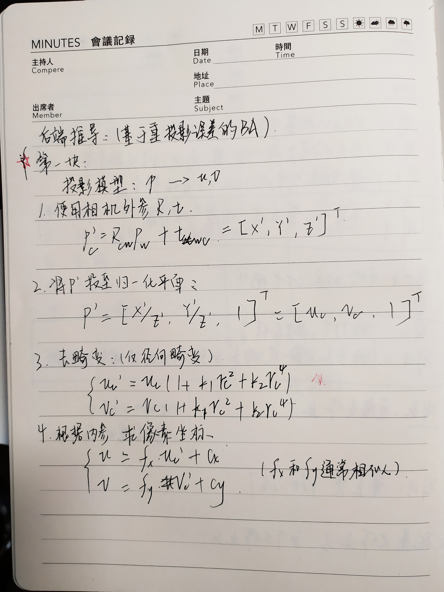
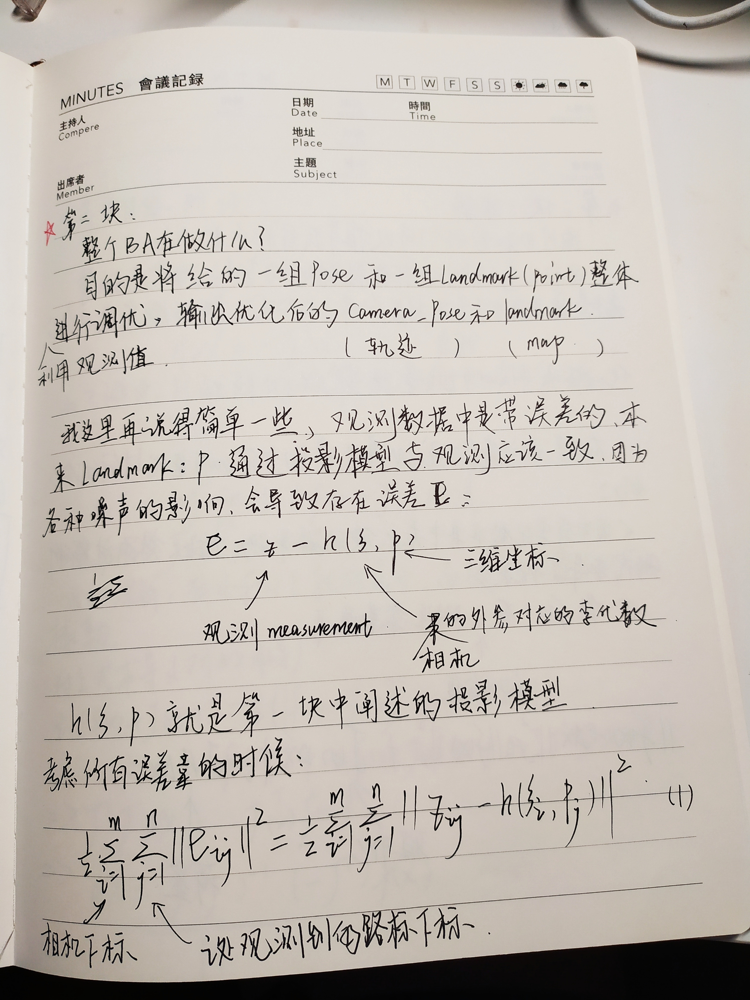
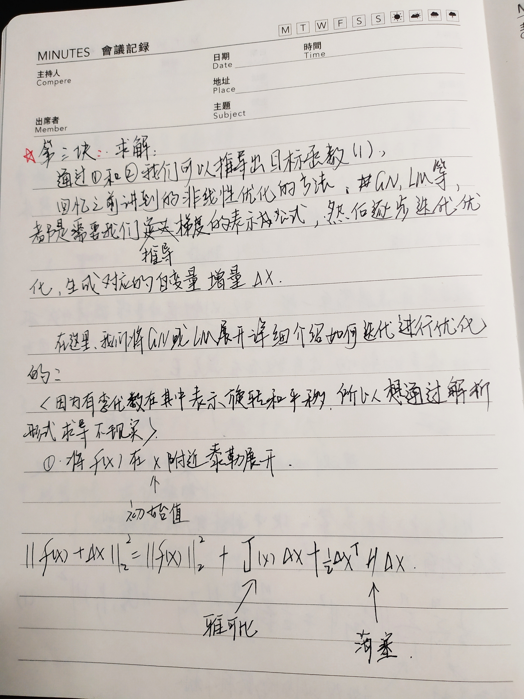
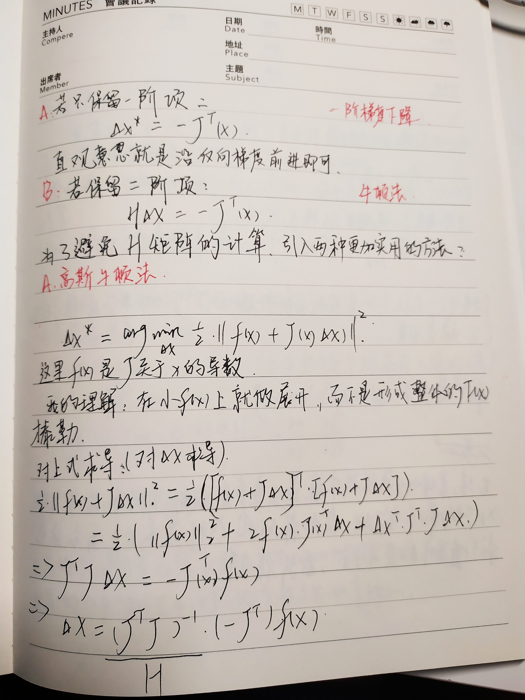
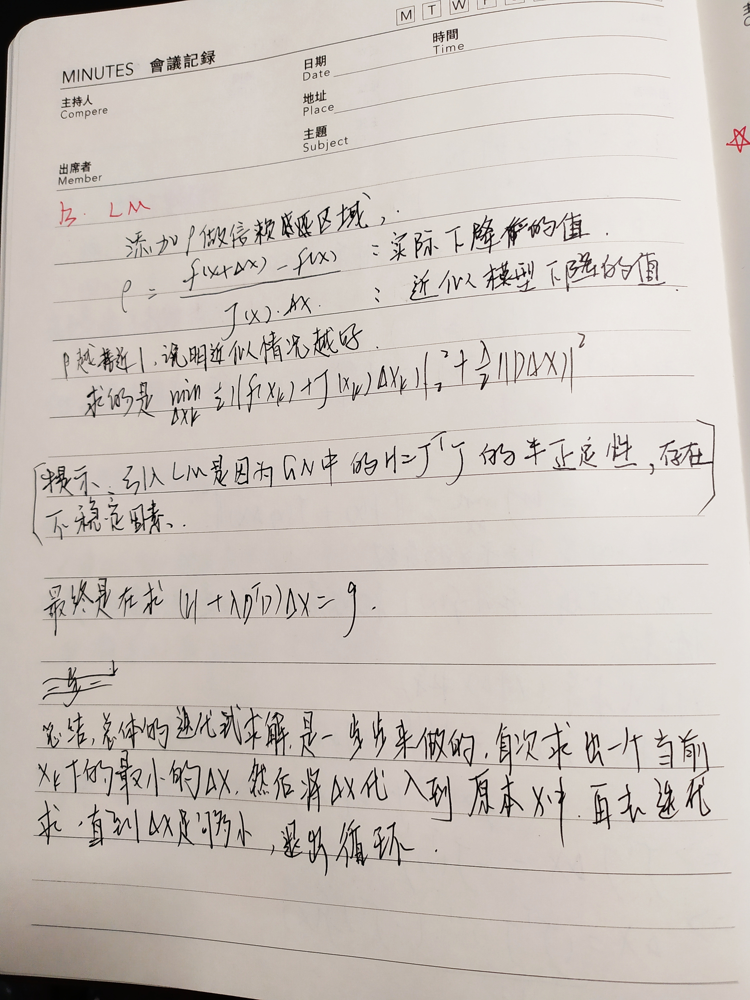
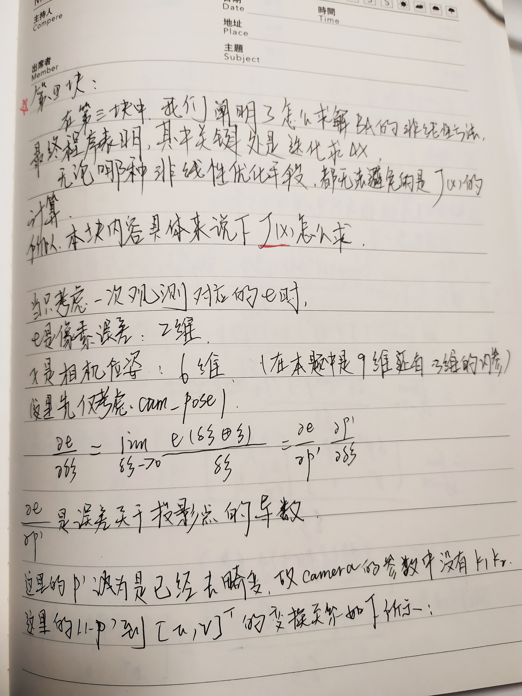
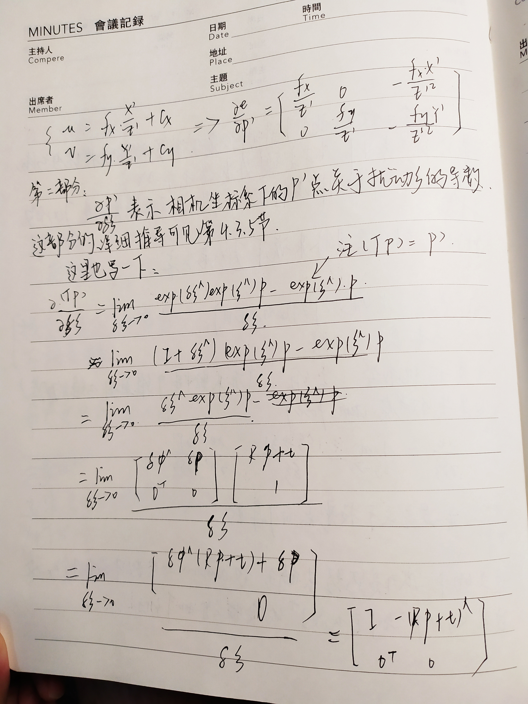
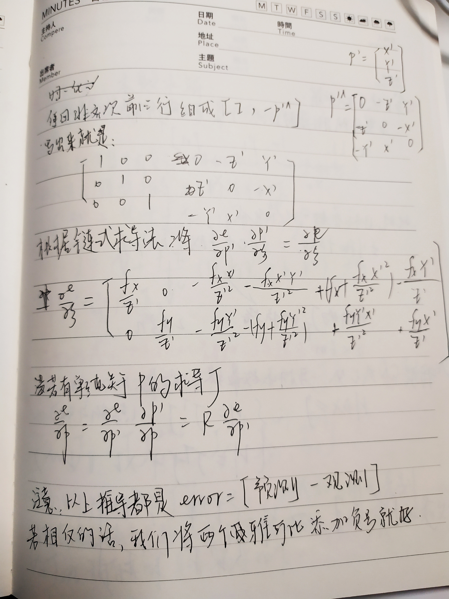
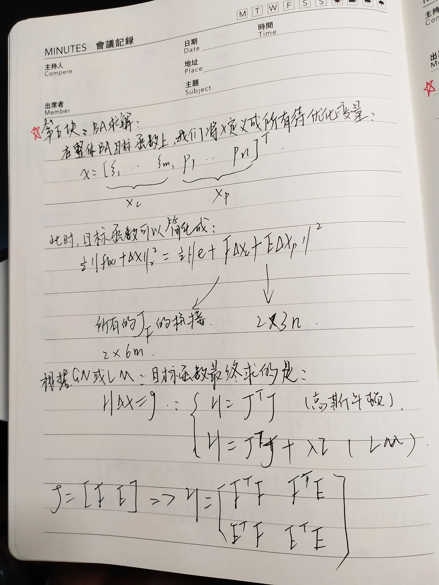
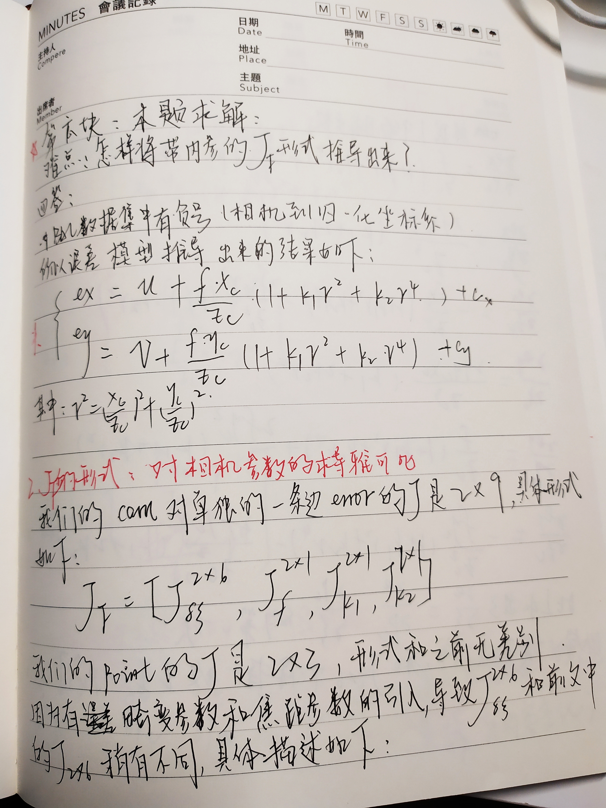
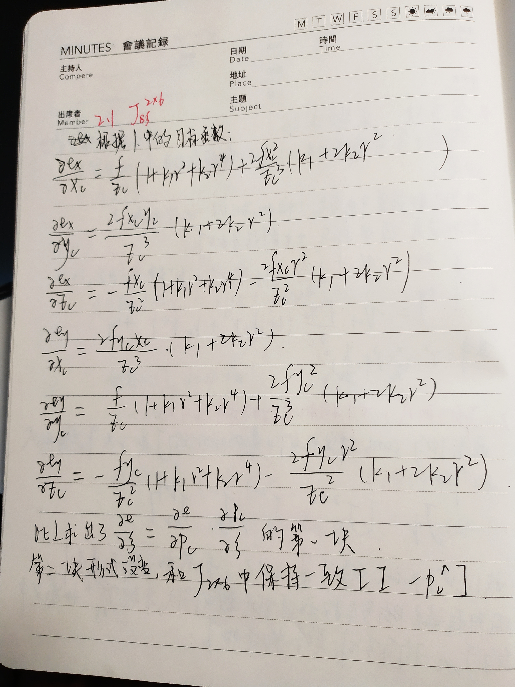


代码部分：（这里仅展示雅克比求导矩阵部分）（完整项目见附件）
```cpp
virtual void linearizeOplus() override {
    VertexCameraBAL *cam = static_cast<VertexCameraBAL *> ( vertex(0));
    VertexPointBAL *point = static_cast<VertexPointBAL *> ( vertex(1));

    Vector3d Pc;
    Pc = cam->estimate()._SE3 * point->estimate();
    // 相机坐标系
    double xc = Pc[0];
    double yc = Pc[1];
    double zc = Pc[2];
    // 归一化坐标系
    double xc1 = -xc / zc;
    double yc1 = -yc / zc;
    double zc1 = -1;

    // Apply second and fourth order radial distortion
    const double &k1 = cam->estimate()._k1;
    const double &k2 = cam->estimate()._k2;

    double r2 = xc1 * xc1 + yc1 * yc1;
    double distort = double(1.0) + k1 * r2 + k2 * r2 * r2;

    const double &f = cam->estimate()._f;

    Matrix<double, 2, 6> J_e_kesi;
    Matrix<double, 2, 3> J_e_pc;
    Matrix<double, 3, 6> J_pc_kesi;// = new Eigen::Matrix<double,3,6>::Zero();
    Matrix<double, 2, 1> J_e_f;
    Matrix<double, 2, 2> J_e_k;
    Matrix3d pc_hat;

    double zc_2 = zc * zc;
    double zc_3 = zc_2 * zc;
    double d2 = k1 + 2 * k2 * r2;

    J_e_pc(0, 0) = f / zc * distort + 2 * f * xc * xc / zc_3 * d2;
    J_e_pc(0, 1) = 2 * f * xc * yc / zc_3 * d2;
    J_e_pc(0, 2) = -f * xc / zc_2 * distort - 2 * f * xc * r2 / zc_2 * d2;
    J_e_pc(1, 0) = 2 * f * xc * yc / zc_3 * d2;
    J_e_pc(1, 1) = f / zc * distort + 2 * f * yc * yc / zc_3 * d2;
    J_e_pc(1, 2) = -f * yc / zc_2 * distort - 2 * f * yc * r2 / zc_2 * d2;

    pc_hat << 0, zc, -yc,
             -zc, 0, xc,
             yc, -xc, 0;
    J_pc_kesi.block(0,0,3,3) = Matrix3d::Identity();
    J_pc_kesi.block(0,3,3,3) = pc_hat;

    J_e_kesi = J_e_pc * J_pc_kesi;

    J_e_f(0, 0) = xc / zc * distort;
    J_e_f(1, 0) = yc / zc * distort;

    J_e_k(0, 0) = f * xc * r2 / zc;
    J_e_k(0, 1) = f * xc * r2 * r2 / zc;

    J_e_k(1, 0) = f * yc * r2 / zc;
    J_e_k(1, 1) = f * yc * r2 * r2 / zc;

    _jacobianOplusXi.block(0, 0, 2, 6) = J_e_kesi;
    _jacobianOplusXi.block(0, 6, 2, 1) = J_e_f;
    _jacobianOplusXi.block(0, 7, 2, 2) = J_e_k;

    Matrix<double, 2, 3> J_e_pw;
    J_e_pw = J_e_pc * cam->estimate()._SE3.rotation_matrix();
    _jacobianOplusXj = J_e_pw;
}
```

结果验证：


这里还是使用《十四讲》上的BAL数据集，因为其他数据集输出效果不理想，图都挤在一起，太大的数据集干脆无法显示。


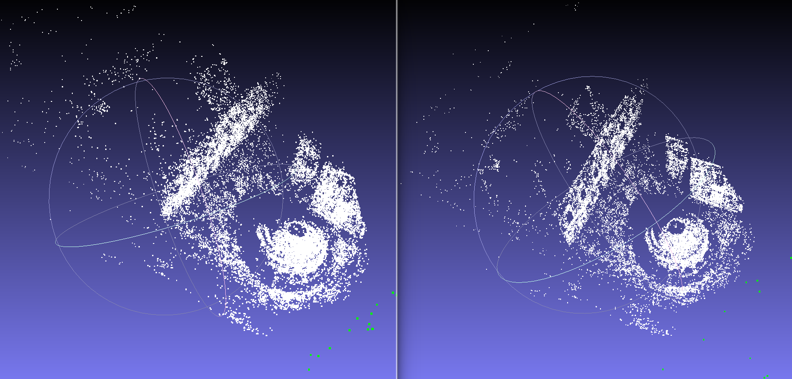


## 二、直接法的BA

#### 1. 数学模型

特征点法的BA以最小化重投影误差为目标，相对的，如果我们以最小化光度误差为目标，就得到了直接法的BA。之前我们在直接法VO中，谈到如何用直接法去估计相机位姿。但是直接法也可以处理整个BA。

下面，请你推到直接法BA的数学模型，完成g2o的实现。

注意：我们用x,y,z参数化每个3D点，而实际的直接法多采用逆深度参数化。使用逆深度会有一种类似归一化的效果，防止因为距离太远，导致对其他参数不敏感。

本题给定7张照片，每张图片对应相机位姿初始值为Ti, 以Tcw存储在poses.txt文件中，其中每一行代表一个相机位姿，格式同之前一致。
同时，还有一个3D点集P, 共N个点。其中每个点的初始坐标基座pi. 每个带你都有自己的固定灰度值，16个该点周围4×4小块读数表示，顺序是列优先。

我们知道，可以把每个点投影到每个图像上，然后再看投影后点周围的小块与原始的4×4小块的差别。那么，整体优化目标函数如下：


也就是最小化任意点在任意图像中投影与其本身颜色之差。其中K是相机内参，pi是投影函数，W是整个patch。下面请回答：
1. 如何描述任意一点投影在任意一张图像中的error？


2. 每个error关联几个优化变量？


3. error关于各变量的雅克比是什么？

**图片上的2,3,4对应上述问题做了回答**

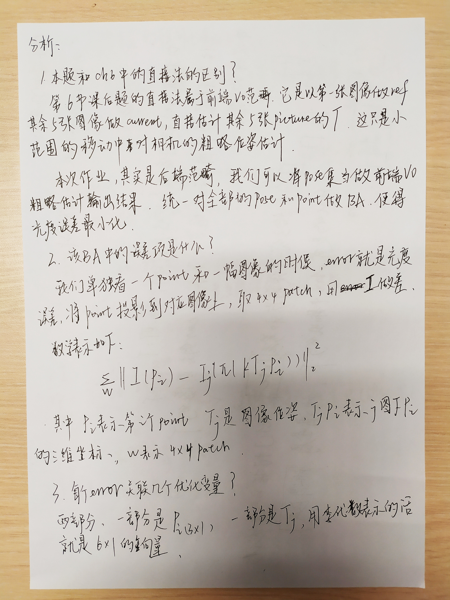

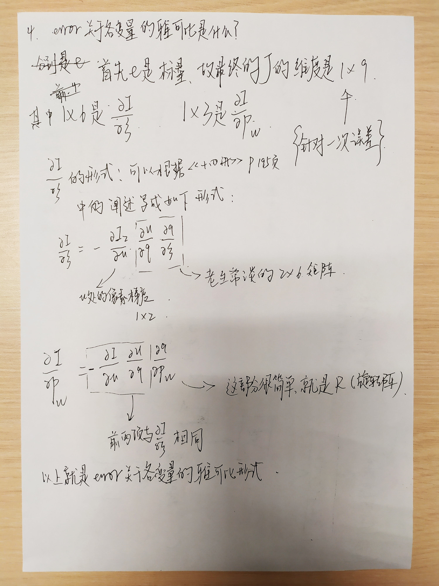

#### 2. 实现

根据上面说明，使用g2o实现上述优化。用pangolin绘制优化结果。

```代码部分
//
// Created by xuzhi.
// this program shows how to perform direct bundle adjustment
//
#include <iostream>

using namespace std;

#include <g2o/core/base_unary_edge.h>
#include <g2o/core/base_binary_edge.h>
#include <g2o/core/base_vertex.h>
#include <g2o/core/block_solver.h>
#include <g2o/core/optimization_algorithm_levenberg.h>
#include <g2o/solvers/dense/linear_solver_dense.h>
#include <g2o/core/robust_kernel.h>
#include <g2o/core/robust_kernel_impl.h>
#include <g2o/types/sba/types_six_dof_expmap.h>

#include <Eigen/Core>
#include <sophus/se3.h>
#include <opencv2/opencv.hpp>

#include <pangolin/pangolin.h>
#include <boost/format.hpp>

#define ROBUST true
using namespace Sophus;
using namespace pangolin;
using namespace g2o;

typedef vector<Sophus::SE3, Eigen::aligned_allocator<Sophus::SE3>> VecSE3;
typedef vector<Eigen::Vector3d, Eigen::aligned_allocator<Eigen::Vector3d>> VecVec3d;

// global variables
// Tcw形式存储相机pose
string pose_file = "../poses.txt";
// 每行表示一个p，前三维表示初始坐标x,y,z, 后面的16维表示周围的patch灰度值
string points_file = "../points.txt";

// intrinsics
float fx = 277.34;
float fy = 291.402;
float cx = 312.234;
float cy = 239.777;

// bilinear interpolation
// 返回值是浮点类型
inline float GetPixelValue(const cv::Mat &img, float x, float y) {
    uchar *data = &img.data[int(y) * img.step + int(x)];
    float xx = x - floor(x);
    float yy = y - floor(y);
    return float(
            (1 - xx) * (1 - yy) * data[0] +
            xx * (1 - yy) * data[1] +
            (1 - xx) * yy * data[img.step] +
            xx * yy * data[img.step + 1]
    );
}

// g2o vertex that use sophus::SE3 as pose
class VertexSophus : public g2o::BaseVertex<6, Sophus::SE3> {
public:
    EIGEN_MAKE_ALIGNED_OPERATOR_NEW

    VertexSophus() {}

    ~VertexSophus() {}

    bool read(std::istream &is) {}

    bool write(std::ostream &os) const {}

    virtual void setToOriginImpl() {
        _estimate = Sophus::SE3();
    }

    virtual void oplusImpl(const double *update_) {
        Eigen::Map<const Eigen::Matrix<double, 6, 1>> update(update_);
        setEstimate(Sophus::SE3::exp(update) * estimate());
    }
};

// TODO edge of projection error, implement it
// 16x1 error, which is the errors in patch
typedef Eigen::Matrix<double,16,1> Vector16d;
class EdgeDirectProjection : public g2o::BaseBinaryEdge<16, Vector16d, g2o::VertexSBAPointXYZ, VertexSophus> {
public:
    EIGEN_MAKE_ALIGNED_OPERATOR_NEW;

    EdgeDirectProjection(float *color, cv::Mat &target) {
        this->origColor = color;
        this->targetImg = target;
        this->w = targetImg.cols;
        this->h = targetImg.rows;

    }

    ~EdgeDirectProjection() {}


    virtual void computeError() override {
        // TODO START YOUR CODE HERE
        // compute projection error ...
        const VertexSBAPointXYZ *vertexPw = static_cast<const VertexSBAPointXYZ * >(vertex(0));
        const VertexSophus *vertexTcw = static_cast<const VertexSophus * >(vertex(1));
        Vector3d Pc = vertexTcw->estimate() * vertexPw->estimate();
        float u = Pc[0] / Pc[2] * fx + cx;
        float v = Pc[1] / Pc[2] * fy + cy;
        if (u - 2 < 0 || v - 2 <0 || u+1 >= w || v + 1 >= h) {
            this->setLevel(1);
            for (int n = 0; n < 16; n++)
                _error[n] = 0;
        } else {
            for (int i = -2; i < 2; i++) {
                for (int j = -2; j < 2; j++) {
                    int num = 4 * i + j + 10;
                    _error[num] = origColor[num] - GetPixelValue(targetImg, u + i, v + j);
                }
            }
        }
        // END YOUR CODE HERE
    }

    // Let g2o compute jacobian for you
    virtual void linearizeOplus() override {
        if (level() == 1) {
            _jacobianOplusXi = Matrix<double, 16, 3>::Zero();
            _jacobianOplusXj = Matrix<double, 16, 6>::Zero();
            return;
        }
        const VertexSBAPointXYZ *vertexPw = static_cast<const VertexSBAPointXYZ * >(vertex(0));
        const VertexSophus *vertexTcw = static_cast<const VertexSophus * >(vertex(1));
        Vector3d Pc = vertexTcw->estimate() * vertexPw->estimate();
        float x = Pc[0];
        float y = Pc[1];
        float z = Pc[2];
        float inv_z = 1.0 / z;
        float inv_z2 = inv_z * inv_z;
        float u = x * inv_z * fx + cx;
        float v = y * inv_z * fy + cy;

        Matrix<double, 2, 3> J_Puv_Pc;
        J_Puv_Pc(0, 0) = fx * inv_z;
        J_Puv_Pc(0, 1) = 0;
        J_Puv_Pc(0, 2) = -fx * x * inv_z2;
        J_Puv_Pc(1, 0) = 0;
        J_Puv_Pc(1, 1) = fy * inv_z;
        J_Puv_Pc(1, 2) = -fy * y * inv_z2;

        Matrix<double, 3, 6> J_Pc_kesi = Matrix<double, 3, 6>::Zero();
        J_Pc_kesi(0, 0) = 1;
        J_Pc_kesi(0, 4) = z;
        J_Pc_kesi(0, 5) = -y;
        J_Pc_kesi(1, 1) = 1;
        J_Pc_kesi(1, 3) = -z;
        J_Pc_kesi(1, 5) = x;
        J_Pc_kesi(2, 2) = 1;
        J_Pc_kesi(2, 3) = y;
        J_Pc_kesi(2, 4) = -x;

        Matrix<double, 1, 2> J_I_Puv;
        for (int i = -2; i < 2; i++)
            for (int j = -2; j < 2; j++) {
                int num = 4 * i + j + 10;
                J_I_Puv(0, 0) =
                        (GetPixelValue(targetImg, u + i + 1, v + j) - GetPixelValue(targetImg, u + i - 1, v + j)) / 2;
                J_I_Puv(0, 1) =
                        (GetPixelValue(targetImg, u + i, v + j + 1) - GetPixelValue(targetImg, u + i, v + j - 1)) / 2;
                _jacobianOplusXi.block<1, 3>(num, 0) = -J_I_Puv * J_Puv_Pc * vertexTcw->estimate().rotation_matrix();
                _jacobianOplusXj.block<1, 6>(num, 0) = -J_I_Puv * J_Puv_Pc * J_Pc_kesi;
            }
    }

    virtual bool read(istream &in) {}

    virtual bool write(ostream &out) const {}

private:
    cv::Mat targetImg;  // the target image
    float *origColor = nullptr;   // 16 floats, the color of this point
    int w;
    int h;
};

// plot the poses and points for you, need pangolin
void Draw(const VecSE3 &poses, const VecVec3d &points);


int main(int argc, char **argv) {

        VecSE3 poses;
    VecVec3d points;
    ifstream fin(pose_file);

    while (!fin.eof()) {
        double timestamp = 0;
        fin >> timestamp;
        if (timestamp == 0) break;
        double data[7];
        for (auto &d: data) fin >> d;
        poses.push_back(Sophus::SE3(
                Eigen::Quaterniond(data[6], data[3], data[4], data[5]),
                Eigen::Vector3d(data[0], data[1], data[2])
        ));
        if (!fin.good()) break;
    }
    fin.close();

    vector<float *> color;
    fin.open(points_file);
    while (!fin.eof()) {
        double xyz[3] = {0};
        for (int i = 0; i < 3; i++) fin >> xyz[i];
        if (xyz[0] == 0) break;
        points.push_back(Eigen::Vector3d(xyz[0], xyz[1], xyz[2]));
        // 用指针往后递延
        float *c = new float[16];
        for (int i = 0; i < 16; i++) fin >> c[i];
        color.push_back(c);

        if (fin.good() == false) break;
    }
    fin.close();

    cout << "poses: " << poses.size() << ", points: " << points.size() << endl;


    // read images
    vector<cv::Mat> images;
    boost::format fmt("../%d.png");
    for (int i = 0; i < 7; i++) {
        images.push_back(cv::imread((fmt % i).str(), 0));
    }
    cout << "images: " << images.size() << endl;


    // build optimization problem
    typedef g2o::BlockSolver<g2o::BlockSolverTraits<6, 3>> DirectBlock;  // 求解的向量是6＊1的
    DirectBlock::LinearSolverType *linearSolver = new g2o::LinearSolverDense<DirectBlock::PoseMatrixType>();
    DirectBlock *solver_ptr = new DirectBlock(linearSolver);
    g2o::OptimizationAlgorithmLevenberg *solver = new g2o::OptimizationAlgorithmLevenberg(solver_ptr); // L-M
    g2o::SparseOptimizer optimizer;
    optimizer.setAlgorithm(solver);
    optimizer.setVerbose(true);

    // TODO add vertices, edges into the graph optimizer
    // START YOUR CODE HERE
    for (int i = 0; i < points.size(); i++) {
        VertexSBAPointXYZ *vertexPw = new VertexSBAPointXYZ();
        vertexPw->setEstimate(points[i]);
        vertexPw->setId(i);
        vertexPw->setMarginalized(true);
        optimizer.addVertex(vertexPw);
    }
    for (int j = 0; j < poses.size(); j++) {
        VertexSophus *vertexTcw = new VertexSophus();
        vertexTcw->setEstimate(poses[j]);
        vertexTcw->setId(j + points.size());
        optimizer.addVertex(vertexTcw);
    }

    for (int c = 0; c < poses.size(); c++)
        for (int p = 0; p < points.size(); p++) {
            EdgeDirectProjection *edge = new EdgeDirectProjection(color[p], images[c]);
            edge->setVertex(0, dynamic_cast<VertexSBAPointXYZ *>(optimizer.vertex(p)));
            edge->setVertex(1, dynamic_cast<VertexSophus *>(optimizer.vertex(c + points.size())));
            edge->setInformation(Matrix<double, 16, 16>::Identity());
            RobustKernelHuber *rk = new RobustKernelHuber;
            rk->setDelta(1.0);
            edge->setRobustKernel(rk);
            optimizer.addEdge(edge);
        }

    // END YOUR CODE HERE

    // perform optimization
    optimizer.initializeOptimization(0);
    optimizer.optimize(200);

    // TODO fetch data from the optimizer
    // START YOUR CODE HERE
    for (int c = 0; c < poses.size(); c++)
        for (int p = 0; p < points.size(); p++) {
            Vector3d Pw = dynamic_cast<VertexSBAPointXYZ *>(optimizer.vertex(p))->estimate();
            points[p] = Pw;
            SE3 Tcw = dynamic_cast<VertexSophus *>(optimizer.vertex(c + points.size()))->estimate();
            poses[c] = Tcw;
        }
    // END YOUR CODE HERE
    // plot the optimized points and poses
    Draw(poses, points);

    // delete color data
    for (auto &c: color) delete[] c;
    return 0;
}

void Draw(const VecSE3 &poses, const VecVec3d &points) {
    if (poses.empty() || points.empty()) {
        cerr << "parameter is empty!" << endl;
        return;
    }

    // create pangolin window and plot the trajectory
    pangolin::CreateWindowAndBind("Trajectory Viewer", 1024, 768);
    glEnable(GL_DEPTH_TEST);
    glEnable(GL_BLEND);
    glBlendFunc(GL_SRC_ALPHA, GL_ONE_MINUS_SRC_ALPHA);

    pangolin::OpenGlRenderState s_cam(
            pangolin::ProjectionMatrix(1024, 768, 500, 500, 512, 389, 0.1, 1000),
            pangolin::ModelViewLookAt(0, -0.1, -1.8, 0, 0, 0, 0.0, -1.0, 0.0)
    );

    pangolin::View &d_cam = pangolin::CreateDisplay()
            .SetBounds(0.0, 1.0, pangolin::Attach::Pix(175), 1.0, -1024.0f / 768.0f)
            .SetHandler(new pangolin::Handler3D(s_cam));


    while (pangolin::ShouldQuit() == false) {
        glClear(GL_COLOR_BUFFER_BIT | GL_DEPTH_BUFFER_BIT);

        d_cam.Activate(s_cam);
        glClearColor(0.0f, 0.0f, 0.0f, 0.0f);

        // draw poses
        float sz = 0.1;
        int width = 640, height = 480;
        for (auto &Tcw: poses) {
            glPushMatrix();
            Sophus::Matrix4f m = Tcw.inverse().matrix().cast<float>();
            glMultMatrixf((GLfloat *) m.data());
            glColor3f(1, 0, 0);
            glLineWidth(2);
            glBegin(GL_LINES);
            glVertex3f(0, 0, 0);
            glVertex3f(sz * (0 - cx) / fx, sz * (0 - cy) / fy, sz);
            glVertex3f(0, 0, 0);
            glVertex3f(sz * (0 - cx) / fx, sz * (height - 1 - cy) / fy, sz);
            glVertex3f(0, 0, 0);
            glVertex3f(sz * (width - 1 - cx) / fx, sz * (height - 1 - cy) / fy, sz);
            glVertex3f(0, 0, 0);
            glVertex3f(sz * (width - 1 - cx) / fx, sz * (0 - cy) / fy, sz);
            glVertex3f(sz * (width - 1 - cx) / fx, sz * (0 - cy) / fy, sz);
            glVertex3f(sz * (width - 1 - cx) / fx, sz * (height - 1 - cy) / fy, sz);
            glVertex3f(sz * (width - 1 - cx) / fx, sz * (height - 1 - cy) / fy, sz);
            glVertex3f(sz * (0 - cx) / fx, sz * (height - 1 - cy) / fy, sz);
            glVertex3f(sz * (0 - cx) / fx, sz * (height - 1 - cy) / fy, sz);
            glVertex3f(sz * (0 - cx) / fx, sz * (0 - cy) / fy, sz);
            glVertex3f(sz * (0 - cx) / fx, sz * (0 - cy) / fy, sz);
            glVertex3f(sz * (width - 1 - cx) / fx, sz * (0 - cy) / fy, sz);
            glEnd();
            glPopMatrix();
        }

        // points
        glPointSize(2);
        glBegin(GL_POINTS);
        for (size_t i = 0; i < points.size(); i++) {
            glColor3f(0.0, points[i][2]/4, 1.0-points[i][2]/4);
            glVertex3d(points[i][0], points[i][1], points[i][2]);
        }
        glEnd();

        pangolin::FinishFrame();
        usleep(5000);   // sleep 5 ms
    }
}


```

输出结果：

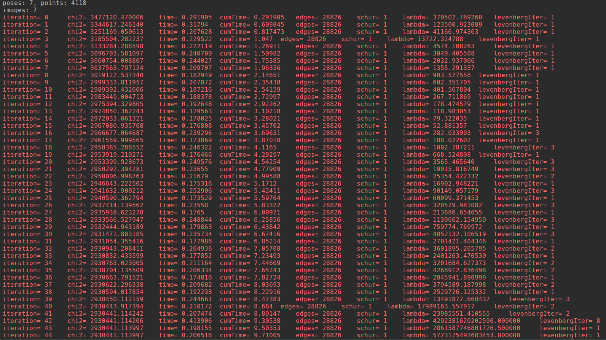

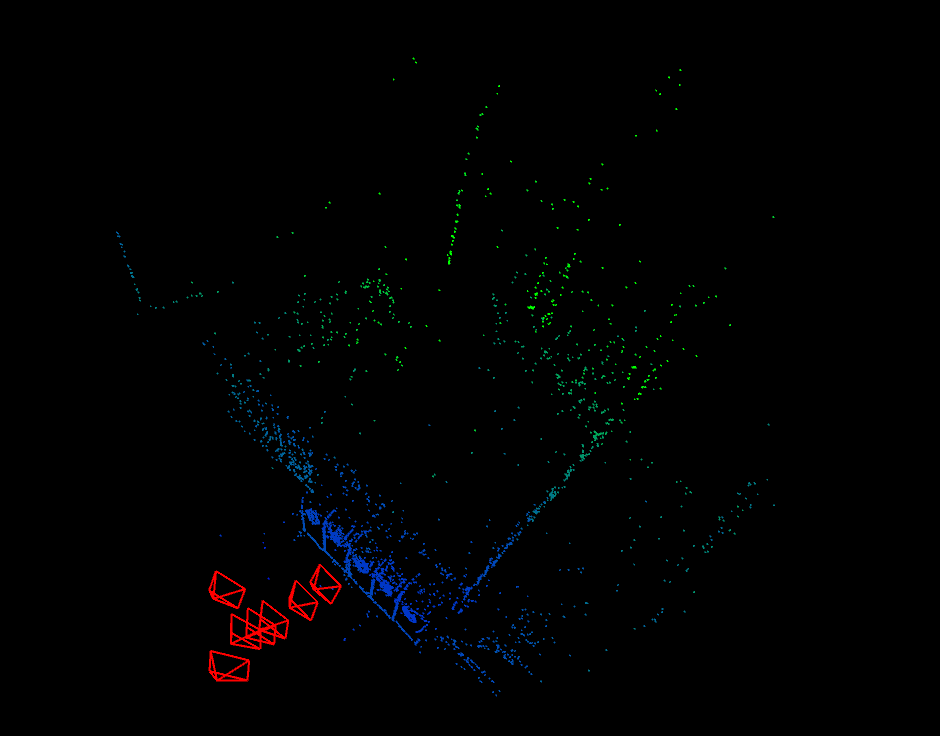

同时思考并回答如下问题：

1. 能否不用[x,y,z]形式参数化每个点？

**回答：**

可以的，使用uv+深度信息也可以。

2. patch的大小选取有什么说法？

**回答：**

取小误差增大，取大了计算量指数增长，所以我认为这里的4×4挺合理的。

3. 从本题中，你看到直接法跟特征点法在BA阶段有何不同？

**回答：**
大部分都差不多，最大的差异体现在雅克比矩阵的计算以及误差的定义上。


4. 由于图像的差异，你可能需要鲁棒核函数，例如Huber。那Huber的阈值怎么选取?

如果误差服从高斯分布,误差项的平方服从卡方分布,根据确定的误差项自由度、置信度,查卡方分布表可以得出其 p 值,即 Huber 阈值

一般置信度假设 0.95

4×4 的 patch,其 error 维度为 16,自由度为 16。

**回答：**
